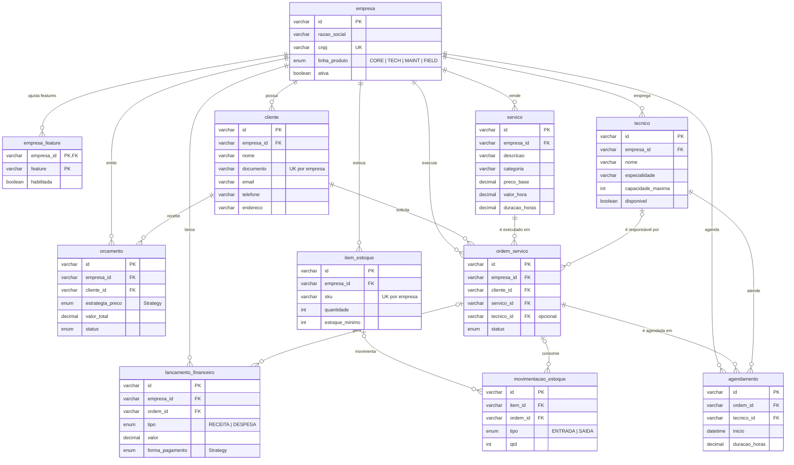

# Modelo do banco — NEXORA

11 tabelas (MySQL 8, InnoDB, utf8mb4). O script completo está em [`schema.sql`](schema.sql); consultas prontas para a apresentação em [`consultas-demo.sql`](consultas-demo.sql).

## Decisões que valem ser citadas na defesa

| Decisão | Por quê |
|---|---|
| `empresa_id` em toda tabela de negócio | Multiempresa (SaaS): o mesmo banco atende várias empresas, e o `RepositorioBase` filtra por empresa em toda leitura, alteração e exclusão. |
| `empresa.linha_produto` + `empresa_feature` | A **variabilidade da LPS mora no banco**: o produto contratado define as features padrão e a tabela de ajustes liga/desliga features opcionais sem recompilar. |
| `UNIQUE (empresa_id, documento)` e `UNIQUE (empresa_id, sku)` | O mesmo CPF/CNPJ pode ser cliente de duas empresas diferentes, mas não duas vezes na mesma. Violação vira 409 com mensagem amigável. |
| Chaves estrangeiras sem `CASCADE` nas telas | Excluir um cliente que tem OS é bloqueado (409) em vez de apagar histórico em cascata. |
| `tecnico_id` opcional na OS | A OS nasce "aberta" sem técnico; a regra "não agenda sem técnico" fica no módulo (camada de negócio), não no banco. |
| `estrategia_preco` e `forma_pagamento` como ENUM | Os valores espelham as classes do padrão Strategy (`PrecoFixo`, `PrecoPorHora`, `PrecoPorVisita`; `PagamentoPix`, `PagamentoBoleto`, `PagamentoCartao`). |
| `CHECK` em valores e quantidades | Última barreira contra preço zero ou estoque negativo, mesmo que alguém grave direto no banco. |
| Ids no formato `CLI-0001` gerados no servidor | Legíveis na apresentação e nunca aceitos do navegador. |
