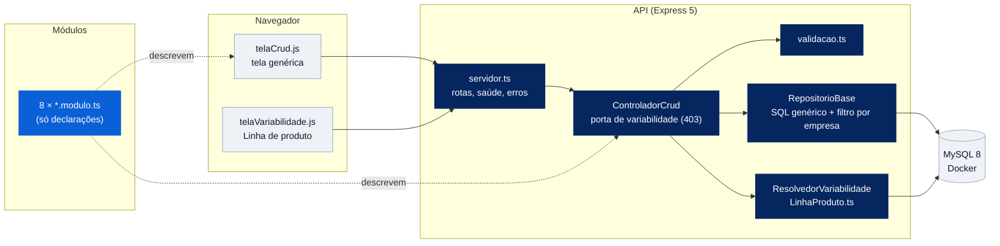

# Arquitetura — NEXORA 2.0

Visão técnica do sistema e das decisões que o moldaram. Serve para a equipe se alinhar e para responder "por que fizeram assim?" na defesa.

## 1. Visão geral

O NEXORA é uma **Linha de Produto de Software (LPS)**: um núcleo de ativos reutilizáveis (core assets) e oito módulos que só *declaram* o que são. Os quatro produtos (Core, Tech, Maint, Field) saem do mesmo código; o que muda é a configuração da empresa, lida em tempo de execução.

## 2. Camadas

| Camada | Pasta | Responsabilidade | Muda quando… |
|---|---|---|---|
| Interface | `public/` | Uma tela CRUD genérica que se monta a partir dos metadados do módulo | muda o design system |
| API | `src/api/` | Monta as rotas dos módulos, saúde da aplicação, tratamento central de erros | entra um endpoint transversal |
| Núcleo (core assets) | `src/nucleo/` | CRUD genérico, validação, variabilidade, conexão, tradução de erros | muda uma regra que vale para todas as telas |
| Módulos | `src/modulos/` | Declaram tabela, campos, validações e regras de uma tela | muda uma tela específica |
| Domínio e padrões | `src/dominio/`, `src/padroes/` | Regras ricas (finalização de OS, cálculo de preço, cobrança) com Singleton, Template Method e Strategy | muda o comportamento do negócio |
| Dados | `banco/` | Esquema, restrições de integridade, dados de demonstração | muda o modelo |

**Regra de dependência:** módulos dependem do núcleo; o núcleo nunca importa um módulo específico. Por isso uma tela nova não exige mexer no núcleo.

## 3. Variabilidade

| Nível | Onde está declarado | Quem decide em tempo de execução | Exemplo |
|---|---|---|---|
| Módulo (tela inteira) | `LinhaProduto.ts` (fonte única) | `ResolvedorVariabilidade` + tabela `empresa_feature` | Estoque existe no Tech e no Field, não no Core |
| Comportamento (dentro de um módulo) | `RegistroFeatures.ts` | Hooks do Template Method | Finalização de instalação registra garantia só se `controle-garantia` estiver ligada |
| Algoritmo | Classes Strategy | Configuração do orçamento ou da cobrança | Preço fixo, por hora ou por visita |

Ligação (*binding*) em **tempo de execução**: o mesmo build atende os quatro produtos, e trocar o produto de uma empresa não exige recompilar nem reiniciar.

## 4. Registro de decisões (ADRs)

### ADR-01 — Projeto só em TypeScript (set/2026)

**Contexto.** A entrega 1 tinha os padrões em TypeScript e uma cópia espelhada em Java. Manter as duas dobrava o trabalho de manutenção, criava o risco de as versões divergirem e exigia duas cadeias de ferramentas (JDK 17 e Node) na máquina da defesa.
**Decisão.** Remover a pasta `java/`. Os padrões ficam só em `src/nucleo/` (Singletons) e `src/padroes/` (Template Method e Strategy), e são os mesmos usados pelo sistema web.
**Consequências.** Uma linguagem, uma cadeia de build, um único lugar para cada padrão. A diferença de sintaxe em relação aos slides (Java) é explicada nos comentários — por exemplo, TypeScript não tem `final`, então o método template é protegido por convenção.

### ADR-02 — Uma tela é uma declaração, não código

**Decisão.** Cada módulo exporta um `ModuloCrud` (dados). Repositório, controlador e tela são genéricos.
**Consequências.** 8 telas com zero código de CRUD repetido. Limite conhecido: telas muito diferentes de um CRUD (ex.: painel do técnico em campo) vão precisar de um tipo de tela novo no núcleo, não de exceções dentro do genérico.

### ADR-03 — Variabilidade em tempo de execução com fonte única

**Decisão.** O modelo de features de módulo mora só em `LinhaProduto.ts`; a escolha de cada empresa fica no banco. `RegistroFeatures` consome esse modelo e acrescenta apenas features de comportamento.
**Por quê.** Na versão 1 os dois arquivos tinham listas diferentes para o mesmo produto — duas fontes da verdade. A unificação elimina a contradição.
**Pendente.** Confirmar com o professor que ligação em tempo de execução atende o que ele espera da disciplina.

### ADR-04 — MySQL 8 em Docker

**Decisão.** Banco em container (`docker-compose.yml`), iniciado com o `schema.sql` na primeira subida.
**Por quê.** Os quatro integrantes têm exatamente a mesma versão e configuração, sem instalar MySQL no Windows; `npm run banco:resetar` volta ao estado da demonstração em segundos. XAMPP continua possível como plano B (ver guia).

### ADR-05 — Isolamento multiempresa no repositório genérico

**Decisão.** Toda consulta, alteração e exclusão por id inclui `empresa_id` (`RepositorioBase.filtroId`).
**Por quê.** Na v1, editar e excluir não conferiam a empresa; qualquer um com o id de outra empresa conseguia alterá-la. Estar no núcleo garante a regra nas 8 telas de uma vez, e o `npm run testar` verifica.

### ADR-06 — Sem ORM, sem framework de front, sem bundler

**Por quê.** É um projeto acadêmico avaliado pela leitura do código. SQL explícito e ES modules nativos deixam cada passo visível. A troca por NestJS/React (recomendada no dossiê de arquitetura para produção) fica como evolução, não como requisito da disciplina.

## 5. Qualidade e verificação

| Verificação | Comando | O que garante |
|---|---|---|
| Tipos | `npm run verificar` | TypeScript em modo `strict` sem erros |
| Fumaça da API | `npm run testar` | 66 verificações: CRUD das 8 telas, regras, isolamento entre empresas, variabilidade |
| Padrões | `npm run demo` | Singleton, Template Method e Strategy funcionando sem banco |
| Saúde | `GET /api/saude` | Aplicação e banco respondendo |
| Dependências | `npm audit --omit=dev` | Sem vulnerabilidades conhecidas (0 na versão 2.0) |

## 6. Evoluções previstas (fora do escopo atual)

- Autenticação e perfis (o ativo "Autenticação" está definido, mas ainda não implementado no sistema web).
- Tela de campo mobile-first para o técnico (360 px), fora do modelo CRUD.
- Testes automatizados de unidade para os padrões, rodando em CI.
- Migrações versionadas do banco no lugar de um único `schema.sql`.
